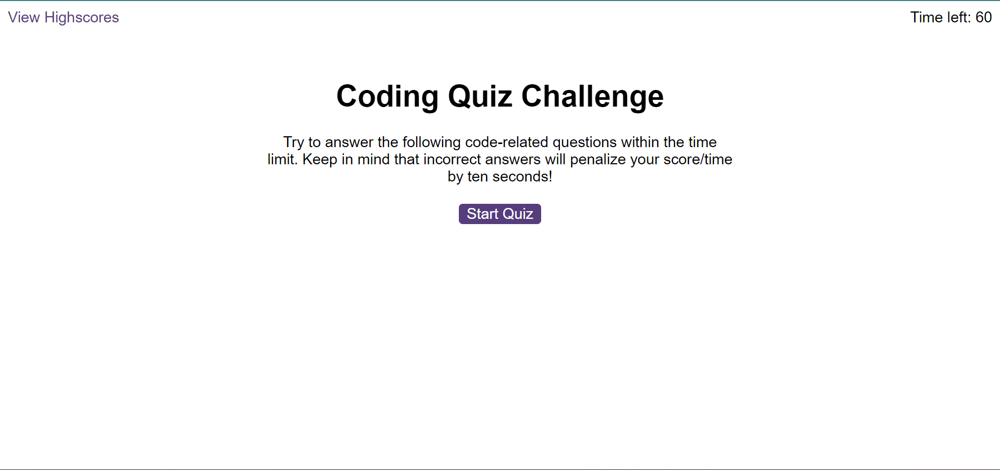
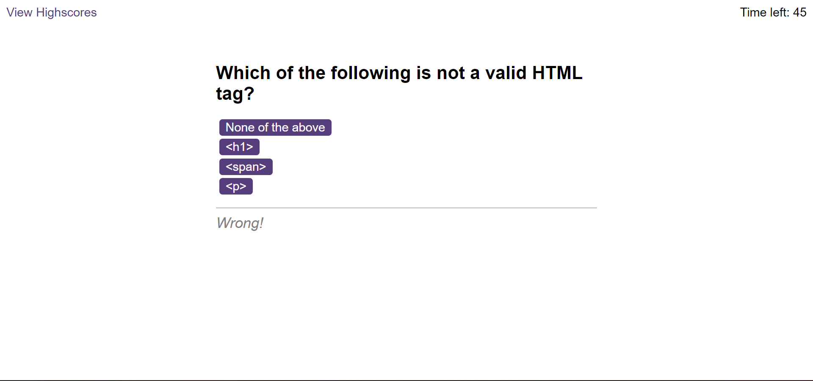
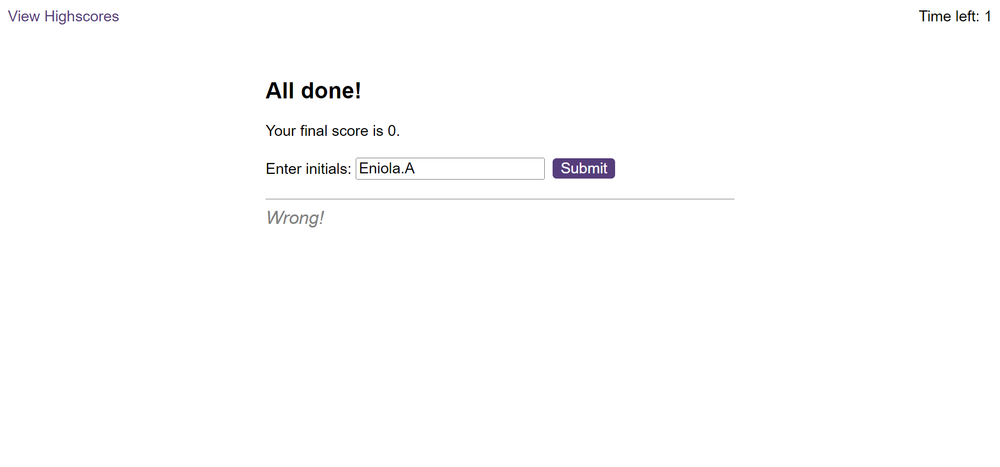
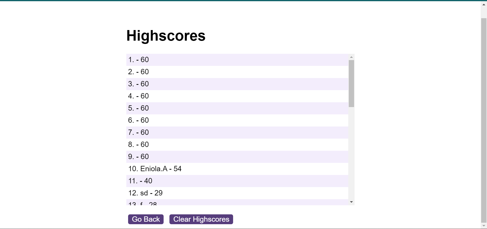

# code-quiz

## Description

This is a multiple-choice quiz game built with HTML, CSS, and JavaScript. The purpose of the game is to test the user's knowledge of a specific topic,and in this context, it's programming.

The game features a timer that counts down from a fixed amount of time, (60 seconds), and deducts 10 seconds from the user's time for incorrect answers. The user can answer the questions by clicking on the options presented on the screen, and the game provides instant feedback on whether the answer is correct or not.

At the end of the game, the user can enter their initials to save their score and see how they rank on the highscores leaderboard. The scores are stored in the browser's local storage, so they display despite various tries.

## Usage

To start the quiz, click the "Start Quiz" button. You will be presented with a series of multiple-choice questions. Click on the answer that you believe is correct. If your answer is correct, you will receive feedback ("Correct!" or "Wrong!"), and move on to the next question. If your answer is incorrect, you will receive feedback and 10 seconds will be deducted from the timer. The quiz will end when either all the questions have been answered or the timer runs out. At this point, you will be prompted to enter your initials to save your score on the highscores page.

## Screenshots

## License 
MIT. 

